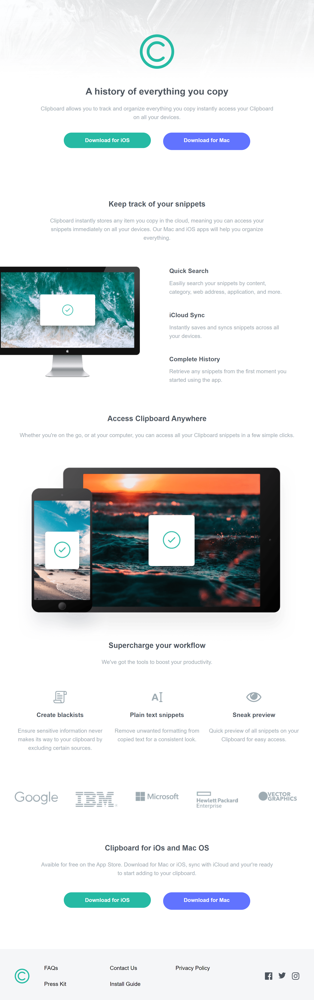

# Frontend Mentor - Clipboard landing page solution

This is a solution to the [Clipboard landing page challenge on Frontend Mentor](https://www.frontendmentor.io/challenges/clipboard-landing-page-5cc9bccd6c4c91111378ecb9). Frontend Mentor challenges help you improve your coding skills by building realistic projects.

# The challenge

Users should be able to:

- View the optimal layout for the site depending on their device's screen size
- See hover states for all interactive elements on the page

# Screenshot

# Built with

- Semantic HTML5 markup
- CSS custom properties
- Flexbox
- CSS Grid
- Mobile-first workflow
- [Tailwindcss](https://tailwindcss.com/) - CSS Framework

# What I learned

In this project, my main aim was to familiarize myself with tailwind to see how it works and play with concepts such as hover state, responsiveness and dark mode. This being my second tailwind project, I enjoyed the process.

# Author

- Twitter - [@Cousnay](https://twitter.com/Cousnay)